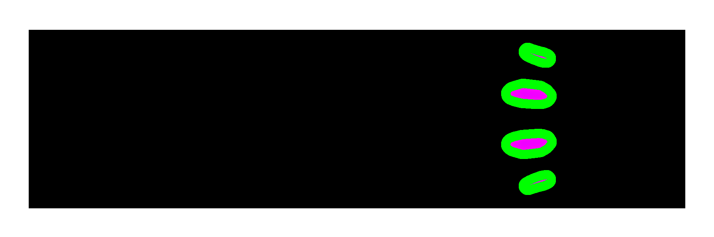

# CETP Prototype

 

 A Jowwi, a raptor-like creature, created by Rebecca "DarkEdgeTV". This creature and
 some of her artwork can be found on ArtStation: https://www.artstation.com/artwork/gZW4E
 The specific 3D Mesh used in this example render GIF was created by myself, Thorhian.

## The Goal:
A prototype program for creating tool paths for CNC Milling Machines,
controlling the engagement of endmills to the stock material to be cut. 

This is being created in Python 3 at this time, due to the many libraries
available in its ecosystem and to make it easier to integrate into projects such
as FreeCAD if this prototype yields good results. However, this prototype uses
OpenGL for rendering 3D meshes. There are plans to use OpenGL compute shaders
for critical sections of the prototype that can be executed in parallel as well.
Eventually, if needed, other sections that don't see benefit of being
implemented on the GPU may be replaced with C++ code if need be. I hope the
compute shaders will be enough to make this prototype usable though. The library
used to access OpenGL is ModernGL.

The wider availability of smarter tool path planning algorithms is important to
me, since manufacturing and machining seem to be extremely under-appreciated to
my generation and those who are younger than I am as well. I want to make it
easier to discover and actually make programs for CNC Milling Machines, since
without them and all of the other modern machine tools (lathes, EDM, grinding,
etc), we would not be living in the world we have today.

## Current Progress:

    - Model and stock geometry are loaded as STL files, given by command line arguments.
    - Rendering of the target model and stock geometry works
    - Edge Detection and Edge expansion algorithms in GLSL are working
    - GLSL Compute Shader for counting pixel types has been implemented
    - GLSL Fragment shader for performing "cuts" on rendered images has been implemented.
    - Added a small path example to cut around the perimeter of the image.
    - Stock Island Detection and Labeling Working Thanks to OpenCV

## How To Run

pyThunder_Path does not yet generate tool paths, but you can
run what has been created so far and see some of the rendered
images that will be used for generating those tool paths.

First, clone the repository wherever you want to keep the software:

```
git clone https://github.com/Thorhian/pyThunder_Path.git
```

You can use ssh if you want:

```
git clone git@github.com:Thorhian/pyThunder_Path.git
```

pyThunder_Path uses the Pipenv tool to manage a python virtual environment. If
you would like to use pipenv, make sure it is installed on your system first.
Once you have it, simply enter the repository folder and run:

```
pipenv install
```

This will setup a python virtual environment and install the needed packages
inside of that environment to run pyThunder_Path. If you would like to
make running the software in your terminal easier, you can run `pipenv shell`.
This will make your terminal enter that python virtual environment, you
can run from inside it. If you don't want to do that, you will need
to prepend `pipenv run` to all commands used to activate pyThunder_Path.

pyThunder_Path will be receiving a TCP/JSON interface to receive 3D model
and other needed data to generate tool paths and will send the generated
tool paths back to the client that requested them. For now though, you
can run pyThunder_Path in your terminal/command line prompt.

```
python3 ./main.py /path/to/target/model.stl /path/to/stock/model.stl 12 9.525
```

If you are using `pipenv run`, please replace `python3` (or just `python`)
with `pipenv run`.

`./main.py` is the driver script that initiates pyThunder_CAM from the
terminal/command prompt currently. The next two command line arguments
are the file locations of the STL files that represent the model you
want to be created by your CNC Machine and the STL model that represents
the stock material that will be cut to form that target model. The two
numbers at the end represent the step-down value and the diameter of
the endmill. **_All_** units are assumed to be in millimeters, including
the STL files.

### STL Files: Note of Caution
When exporting an STL file, please make sure of two things:

1. Ensure that the units being used to export the STL' files are in
   millimeters. STL files do not contain scale/unit information inside of them.
   pyThunder_Path currently performs all of it's calculations assumining that
   all length units of measurement are in millimeters.
2. Ensure that the vertices that make up your models in the STL files use the
   model's global/world space instead of it's local space. Essentially,
   the models need to have their vertices to be set to where they will be
   in the coordinate system that represents the work envelope of you CNC
   milling machine.
    
## The Method To The Madness

In order to create an algorithm that is capable of creating tool paths that
control the radial engagement of an endmill, both the target model and stock
material (which could be aluminum, steel, wood, plastic, etc) must taken into
account in the algorithm. The algorithm needs to check how much material will be
removed from a given potential cut, and must change the direction of cut
depending on whether more or less material needs to be removed in a given
cutting step. Like many tool path/CAM systems that have constant engagement
algorithms, these cutting steps are small linear motions.

In order to keep track of the stock material in relation to the target model,
the prototype will render the given models in multiple "additive slices". The
rendering of these models is done with an orthographic projection. This
orthographic projection is expanded on each image according to a user specified
step-down parameter, slowly bringing more parts of the model into the clip space
of the rendering pipeline.  The target model is colored blue (along with some
variations of red to represent depth, making it easier to debug the rendering
code), while pixels that don't represent the target model are either fully
transparent (alpha 0), or black and opaque. Black and Opaque pixels represent
areas where stock material still exists, and fully transparent pixels represent
empty space. In the future, more models can easily be loaded into the render
scene, and colored purely red (and no blue) to represent objects that should not
be cut, making it easier to handle obstacle avoidance.

After the target model and stock have been rendered, a pair of GLSL programs are
fed the resulting image to first perform simple edge detection and secondly edge
expansion based on the results of the edge detection program. The size of the
expanded edge is determined by the diameter of the endmill to be used along with
extra margin if the user desires to leave some radial stock material. This
expanded edge will be used to help ensure the tool does not collide with the
target model and makes it easy to leave radial stock material, along with
providing a neat finale profile to finish the tool path with.

The amount of renders is determined by the vertical height of the model and the
step-down length parameter provided by the user. The resolution of these images
is determined by the stock model's bounding box size, a resolution scale value,
and a small margin based on diameter of the endmill, a parameter provided by the
user. Each pixel represents a set area depending on stock model's bounding box
and resolution scale value. This rendering process discretizes the target model
and stock model in effect from this rendering process.

Using the rendered images, tool paths can be generated at a starting point,
where the program shall be given an optimal radial engagement parameter that
shall be provided by the user. For a potential cut, which is represented by two
circles of the same radius/ diameter and a rectangle with two sides tangential
to the circles, the pixels that fall within that shape (essentially a capsule)
are checked, counting how many represent empty space, stock material, and target
model material. If target model material is found, the cut is aborted. If there
is too much empty space beyond a certain thresh hold, the cut is aborted. If
there is too much stock material beyond the radial engagement parameter, then
the cut is aborted. Once a good cut is found, the image is edited using that
capsule shape, setting those pixels alpha value to 0.

## References

The software written here was inspired by this paper,
"Automated CNC Tool Path Planning and Machining Simulation on 
Highly Parallel Computing Architectures": https://tigerprints.clemson.edu/cgi/viewcontent.cgi?article=2780&context=all_dissertations

The section of interest that inspired me to finally try my hand
at a tool path planning algorithm is the 3D Roughing Tool Path
Algorithm that utilizes the GPU to create tools paths.

## Donations

If you feel like donating to a noob, you can send Monero to this address:
88Y9jHCrN9vTcWCsBF4gWy5PPEKANvsq7MCR95s2bXch1wBbDNqW21FhLP8xheJitQHkW9FSrRHAp57BpAppUfB9MfTMtf3
